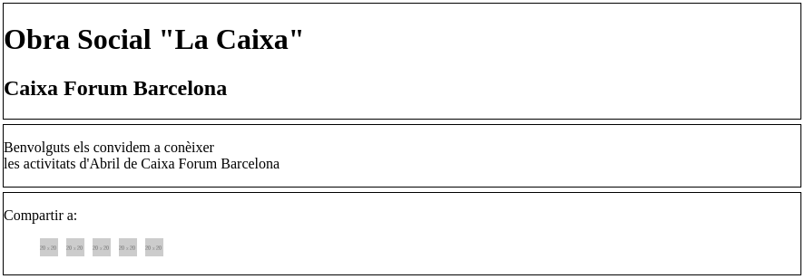

# E05 Newsletters (optional exercise)


This is little deprecated work method I think, but we were instructed about it so I'll write down a little about it.

This is how html newsletter doc starts:
```
<!DOCTYPE html PUBLIC "-//W3C//DTD XHTML 1.1//EN" "http://www.w3.org/TR/xhtml11/DTD/xhtml11.dtd">


<!-- xmlns ATRIBUTO QUE ESPECIFICA EL ESPACIO DE NOMBRES NS, lang ATRIBUTO DE IDIOMA PARA LECTORES DE PANTALLA -->
<html xmlns="http://www.w3.org/1999/xhtml" lang="es">
   <head>
       <title>Newsletter</title>
   </head>
   ```

   Bueno y ahora me voy a dejar un poco de la tontería del inglés y voy a escribir un poco en castellano porque me apetece.

   El caso es que configurar una tabla para que la newsletter sea leída por la mayor cantidad de clientes de correo posible, es lo que resulta tedioso.

   En este caso se tenía que replicar la siguiente newsletter (la primera de arriba)

   


Así que como estábamos en el primer mes de curso todavía prácticamente, aún poníamos el CSS en el mismo documento, pero bueno voy a compartir  parcialmente el inicio de la tabla con y sin estilos para ver si puedo replicar el resultado, que puede ser interesante:


```
<style type="text/css">

caption{
  font-size: 20px;
  text-align: center;
  margin:5px;
}

th.A{
  padding:10px;
  background-color: red;
  color: #ffffff;
}
th.B{
  padding:10px;
  background-color: #f000000;
  color:red;
}
</style>

```
**No aparecerá el caption NEWSLETTER porque hice la imagen en dos tomas para no tener que reducir demasiado la pantalla del navegador**

```

<table cellspacing="0" cellpadding="0" border="1">

  <caption>NEWSLETTER</caption>

<tr>
  <td rowspan="10">
    
  </td>
  <th class="A" abbr="Concert familiar">Concert familiar</th>
</tr>

<tr>
  <th class="B" abbr="Cordes Grillades+2">Cordes grillades +2</th>
</tr>

<tr>
  <td><p><strong>Dissabtes 12, 19, i 26 d'abril i 17.30 h<br/>
  Diumenges 13, 20 i 27 d'abril i 12.00 h</strong></p></td>
</tr>

<tr>
  <td><p>Brossa Quartet de Corda "&amp;" La Botzina</p></td>
</tr>

<tr>
  <td>
    <strong>Aleix Puig i Pere Bartolomé,</strong> violins<br/>
    <strong>Imma Lluch</strong>, viola<br/>
    <strong>Quico Pugès,</strong> violoncel<br/>
    <strong>Maria Vidal,</strong> il·lustracions<br/>
    <strong>Toni Cuesta,</strong> narració i trompeta
  </td>
</tr>

```

A falta de unos pocos estilos CSS más para el interior de las celdas de la derecha y tal, esto que tenemos aquí es lo siguiente:




Importante el rowspan de 10 en la 1º celda de la 1º fila para meter la foto y seguir construyendo todo a partir de ahí.
